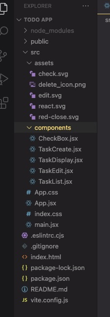

# ToDo List App by Nilin LAY
This ToDo app is built using React and have components that allow adding, deleting, editing and mark complete features. 

## Tech Used
- React JS
- CSS
- JSX
- Figma

## App Features:
- Add Task : users can add new task by typing in the add input box
- Delete Task : users can delete a task by clicking on the trashbin icon and clicking confirm yes button.
- Edit Task : users can edit a task by clicking on the pencil icon. Users can type in new name and save by clicking on check icon or cancel changes by clicking the close icon.
- Toggle Task as done: users can toggle a task as done or not done by ticking the checkbox. 

### Specificity implemented:
Modal : import from react-modal

## Figma UI’s Link: https://www.figma.com/file/ayN5NaBsvPFfbJTAWPfibS/ToDo-List-App-React?type=design&node-id=0%3A1&mode=design&t=ZiGm3DsO2MKZsAeW-1

# Folder Structure

# App Flow: https://www.figma.com/file/shUrcbIEFZsRylvZbTR2cM/ToDo-React-App-Flow?type=whiteboard&node-id=0%3A1&t=U2X57XQsCoVNKYL9-1

# Git Flow Method
### 1. Main Branch:
- 1st commit and Main stores the source as well as stable versions of the code

### 2. Develop:
- It's the base branch of all feature branches and release branch.
- Develop branch initially contains source code from main and add task function
- All feature branches (issue1, issue 2, and issue 3) are merged into develop.
-Develop represent the latest state of the App being developed.

### 3. Feature Branches:
- Features that represents all the functions of the app
    - The feature branches include:
        * feature/issue1: Delete Task
        * feature/issue2: Edit task
        * feature/issue3: Toggle checkbox customization

### 4. Release Branch:
- This is the branch for the app deployment and is based off of develop branch.
- The tag is in the form of 1.0, 1.1, etc.
- Current release version: release/1.0

### 5.Bugfix branch:
- This is the branch used when fixing bugs in release branch. 
- This branch is branched for the current release/1.0 branch.

### 6. Hotfix branch:
- There are no current hotfix branch as of yet but once release is finished, it will be used to fix urgent bugs if found.

# Convention Guide- ToDo React App:

### Use the existing folder structure of a React App generated by Vite:

# File naming:

### HTML files must be all lowercase and ending with .html

CSS files should all be PascalCase ending with .css

Javascript-React files should be PascalCase ending with .jsx

Images should be named with dashes and lowercase letters.

## UX/UI guide:

### Use Heading in hierarchy: h1 -> h2 -> h3 ....

### Layout of content: always use frame for the layout

### Indentation: 20px between elements (y axis)

### Icon Size:

- Max-width: 48px (include touch area)

### Border Radius: 5px

### Font size:

- h1: 32px , line height: 40px, font weight: 500
- h2: 28px , line height: 36px, font weight: 500
- h3: 24px , line height: 32px, font weight: 500
- h1: 32px , line height: 40px, font weight: 500
- Title large- 22px, line height: 28px, font weight: regular
- Title2: 16px, line height: 24px, letter spacing: 0.15px, font weight: medium
- Title3: 14px, line height: 20px, letter spacing: 0.1px, font weight: medium
- Body: 14px, line height: 20px, letter spacing: 0.2px, font weight: regular
- Body: 12px, line height: 16px, letter spacing: 0.4px, font weight: regular

### Color:

- Primary: #6750A4
    - On Primary: #59606D
    - Primary Container: #C6C9DF
    - On Primary container: #FFFFFF
    - Primary Variant: #E2DEFF
- Secondary: #FEEAFA
    - On Secondary: #635B62
    - Secondary Container: #BFB5BD
    - On Secondary container: #FFFFFF
    - Secondary Variant: #EEDDEB
- Tertiary: #EFD3D7
    - On Tertiary: #FFFFFF
    - Tertiary Container: #776A6C
    - On Tertiary container: #FFFFFF
    - Tertiary Variant: #EFDDD3
- Text: #66606A
- Background: #FEFCF9
- Dim Background: #EEECEA

### Grid

- Large min 1440px:
    - 12 columns, centered, each width: 72px, Gutter: 24px
- Medium min(900px):
    - 12 columns, stretch, Margin 24px, Gutter: 24px
- Small (from 900px-600px):
    - 8 columns, stretch, Margin: 32px, Gutter: 16px

### Components

- List component from Google Material Design
- Tab : from Previous Project HealthToGo
- Icons from Google MDC

# CSS Guide:

### Formatting

- Use soft tabs (2 spaces) for indentation
- Use dashes instead of camelCasing names
- Try not to use id selectors as much as possible
- Put a space before a rule’s opening braces
- Try to write one rule per line
- in properties, put a space after the :
- Put closing braces on a new line

### Comments

- Comments on same line for notes on rule
- Comments as a line to mark different rule’s section

# React-JSX Guide:

- Try to include only one component per file.
- Use JSX syntax
- Use .jsx extensions for all components
- Use PascalCase for naming files, components, and their instances
- Use PascalCase when importing components and css file
- Use double quotes instead of single quotes
- Always include 1 space in all self-closing tags
- Do not pad curly braces with spaces
- Use camelCasing  names for props
- Include alt on img tags for accessibility purposes
- Do not write “picture”, “pic”, “image”, “photo”, etc for the alt of the image element
- Wrap JSX tags in parentheses when they span more than one line
- Always self-close a tag that have no children
- Use arrow functions to close over local variables
